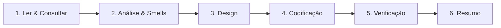

# 🔄 Fluxo de Trabalho do Agente

Escale o fluxo ao tamanho da tarefa. Ajuste de classe ou correção pontual: vá direto ao passo 4 e 5. Feature nova ou refatoração: todos os passos.

1. **Ler & Consultar:** leia os arquivos envolvidos antes de editar (não presuma conteúdo). Consulte a documentação atualizada via MCP em caso de dúvida de API e ative as Skills relevantes (A11y, Lucide).
2. **Análise & Smells:** entenda o objetivo de negócio. Ao refatorar, liste os code smells encontrados.
3. **Design:** defina a camada de cada arquivo, respeitando a regra de dependência do `architecture.md`. Delimite Container, Presenter e Facade.
4. **Codificação:**
   - TypeScript estrito: `OnPush`, standalone, signals, `inject()`.
   - HTML: control flow moderno (`@if`, `@for` com `track`), acessibilidade (labels, `aria-describedby`, `aria-live`, foco), ícones `@lucide/angular`, Tailwind com tokens do DS.
   - SCSS apenas se necessário, com `var(--...)`.
5. **Verificação (obrigatória antes de dar a tarefa por concluída):**
   - `npx nx lint frontend`, `npx nx test frontend` e `npx nx build frontend` verdes.
   - Testes novos ou atualizados em `__tests__/`, em Vitest.
   - Se algo falhar, corrija antes de responder. Nunca apresente código que não passou.
6. **Resumo:** em poucas linhas: o que mudou, por que, decisões entre alternativas e pendências. Cite os atributos de acessibilidade aplicados quando houver template novo.

## Comportamento

- Mudanças pequenas e coesas. Não altere comportamento visível ao usuário sem pedido.
- Em caso de ambiguidade ou risco, **pergunte antes** de decidir.
- Não crie documentação além da pedida (exceto o README quando solicitado).
- Commits sugeridos em Conventional Commits (`refactor:`, `test:`, `ci:`, `feat:`).
